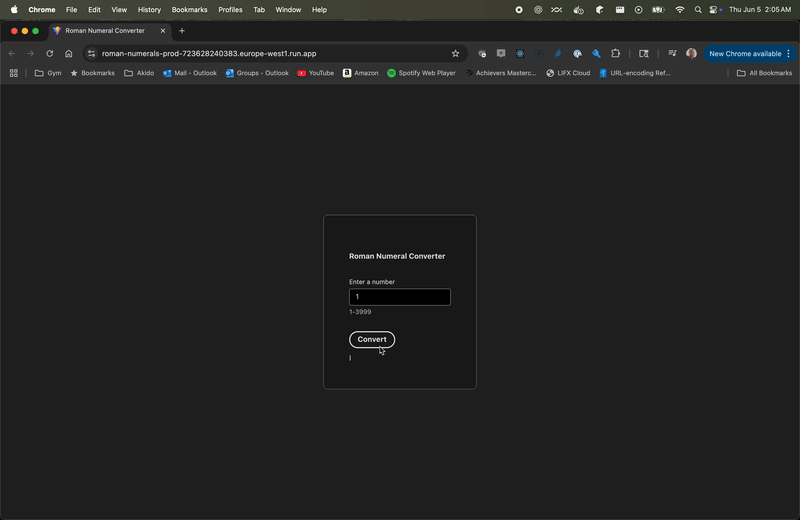

## Roman Numerals

This is a demonstration React project that 
converts integers to roman numerals. It consists of a 
React front end UI and a simple backend nodeJS REST API. 
The React UI allows the user to key any integer between 
1 and 3999. It will POST this number to the nodeJS API 
and display the result. The REST request is handled as
a POST rather than a GET because it concerns the processing
and transformation of the input, rather than retrieval
of a value.

## Demo

The following video demonstrates the Roman numeral converter in action. This application is currently deployed on Google Cloud Services, providing a scalable and reliable hosting environment for both the React frontend and Node.js backend API.

